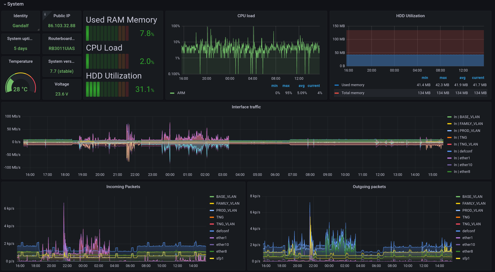
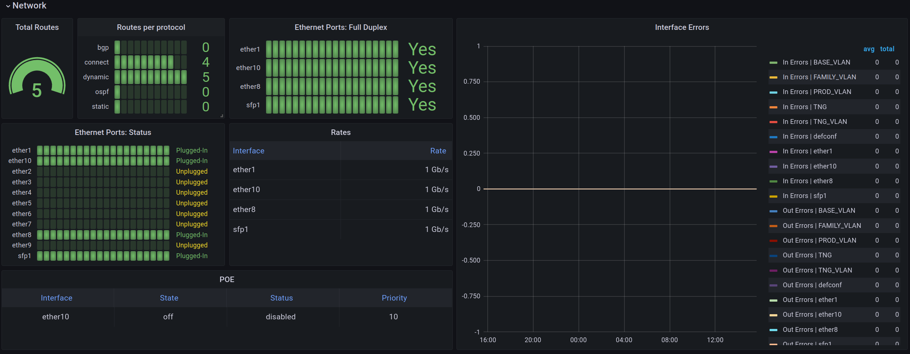
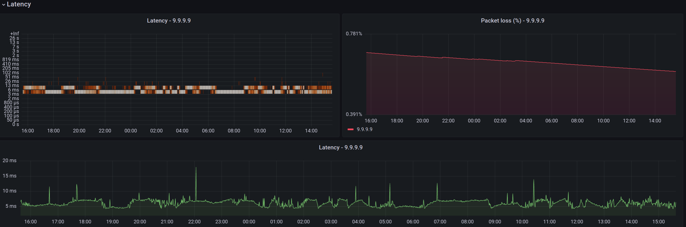
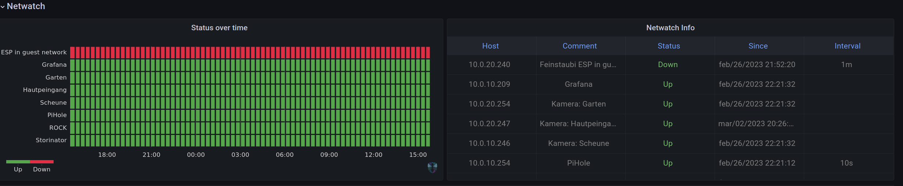
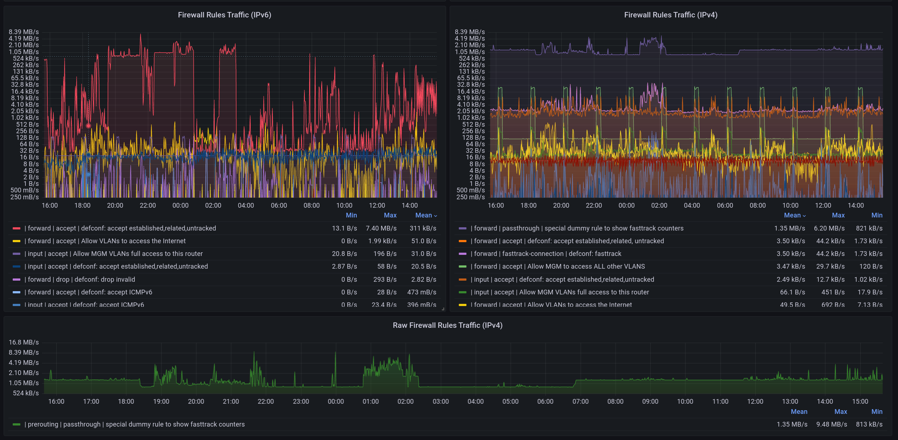
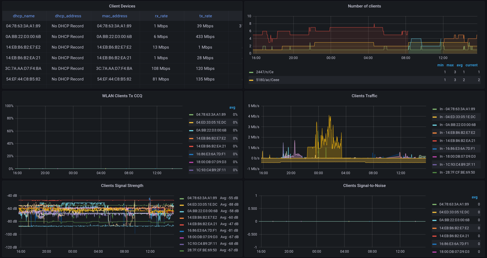
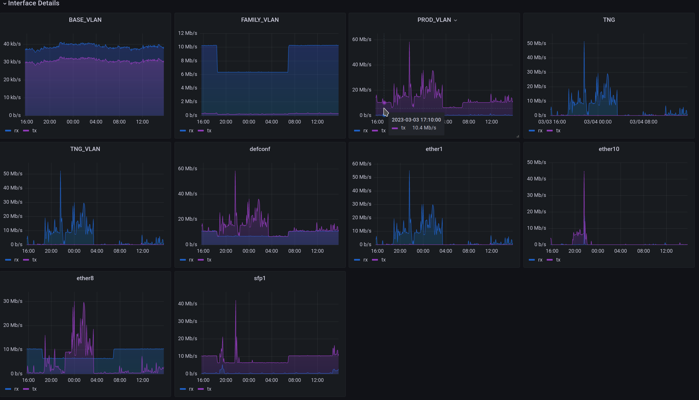

# Monitor your Mikrotik router with Prometheus and Grafana

Use Grafana & Prometheus to monitor Mikrotik devices. This projects serves as a ready to use blueprint for monitoring based on Docker. It is designed and tested to be run on Raspberry Pis.

## Features

- System Health Monitoring
  - disk usage
  - CPU load
  - memory usage
  - public IP address (IPv4 & IPv6)
  - system uptime
  - temperature
  - voltage monitoring
- Interface Monitoring
  - traffic (bit/s)
  - traffic (packets/s)
  - per interface graphs
- Latency Monitoring
  - customizable ICMP and/or UDP pings
  - packet loss
- DHCP Monitoring
  - active leases
  - MAC addresses, host names, addresses
- Network Monitoring
  - routes
  - interfaces errors
  - interface states
  - PoE states
- Firewall Monitoring
  - rules traffic
  - logged rules traffic
  - Ipv4 & IPv6
  - bandwidth
  - active users
- Wireless Monitoring
  - noise floor
  - TxCCQ
  - client devices
  - number of clients
  - traffic
  - signal strength
  - signal to noise ratio
- Netwatch
- CAPsMAN Monitoring
  - remote CAPS
  - registrations
  - clients
  - frequencies
  - signal strength
  - traffic

## Setup

- Router running RouterOS 7.x.x
- Raspberry Pi 4 with 2 gb RAM (other PIs may also work, but I wanted ARM 64 bit)
- before opening a new issue, please take a look at the [FAQ](#FAQ)

## Demo pictures



<details><summary>Show more images</summary>








</details>

## Installation

## Mikrotik Router

At first you need to prepare your router.

Create a group on the device that has API and read-only access:

`/user group add name=prometheus policy=api,read,winbox,test`

Create a user that is part of the group:

`/user add name=prometheus group=prometheus password=TOP_SECRET`

## Prepare Raspi

You need Ubuntu Server for ARM 64 bit in order to use this setup. You may also use Raspian, but then you are limited to 32bit ARM executables. This would mean, that you need to compile the `mikrotik-exporter` by hand, because there are no pre built 32-bit Docker images.

You need to execute the following steps on the target machine itself (e.g. Raspberry Pi).

Install Docker ([official docs](https://docs.docker.com/engine/install/debian/)):

`sudo apt-get install docker-ce docker-ce-cli containerd.io docker-buildx-plugin docker-compose-plugin`

**:warning: Note:** `docker-compose` was originally written in Python, but it was deprecated some time ago. [Migrate to Compose V2](https://docs.docker.com/compose/migrate/).

<details>
<summary>Optional: Build the Docker Image for mktxp</summary>

It might be necessary to build the Docker Image for: https://github.com/akpw/mktxp.
This is especially the case, if your architecture is not:
- linux/amd64
- linux/arm/v7
- linux/arm64

```bash
# Get the mktxp repository
git clone https://github.com/akpw/mktxp.git

# Go into the newly downloaded repo
cd mktxp

# Build the docker image
docker build . -t leonmorten/mktxp:latest
```

</details>

Now get this repo and install all services:

```bash
# Clone this repo
git clone https://github.com/M0r13n/mikrotik_monitoring.git


# Go into the cloned directory
cd mikrotik_monitoring

# Let docker-compose do it's job
docker compose up -d
```

You may need to adjust the following configuration files and add your own credentials for your router:

- `mktxp/mktxp.conf`


Done. You should now be able to open the Grafana dashboard on Port 3000 of your Raspberry Pi.

## Latency Monitoring

This projects uses the Prometheus Blackbox exporter to measure network latency. By default three targets are configured:

- 1.1.1.1 (Cloudflare)
- 8.8.8.8 (Google)
- 9.9.9.9 (IBM)

You may adjust **blackbox/blackbox.yml** according to your needs.

## Multiple Nodes

It is possible to monitor multiple (Mikrotik) devices. Just change add as many devices to `mktxp/mktxp.conf` as you want.

## HTTPS

It is also possible to access the Grafana Dashboard over HTTPS.
Depending on your security requirements and/or threat model it might be a good idea to enable HTTPS.

Generate a self signed certificate for your domain:

`sudo openssl req -x509 -nodes -days 365 -newkey rsa:2048 -keyout ./nginx/nginx-selfsigned.key -out ./nginx/nginx-selfsigned.crt`

Replace the content of `./nginx/nginx.conf` with:

```txt
server {
  listen 80;
	listen [::]:80;
	server_name _;
	return 301 https://$host$request_uri;
}

server {
  listen 443 ssl;
  listen [::]:443 ssl;
  include ssl/self-signed.conf;

  location / {
   proxy_set_header Host $http_host;
   proxy_pass http://grafana:3000/;
  }
}

```

## AppArmor

Under `./docker-armor` you can find an AppArmor profile for this stack. To use it, do the following:

```
cp ./docker-armor /etc/apparmor.d/docker-armor
apparmor_parser -r -W /etc/apparmor.d/docker-armor
docker compose -f docker-compose-armored.yml  up -d
```

## Resources

- [A blog post by Devin Smith that first got me interested](https://blog.devinsmith.co.za/home-internet-grafana-lockdown/)
- [A somewhat useable Grafana Dashboard](https://grafana.com/grafana/dashboards/10950)
- [A Prometheus exporter for Mikrotik devices written in Python](https://github.com/akpw/mktxp).
- [A Prometheus exporter for Mikrotik devices written in Go](https://github.com/nshttpd/mikrotik-exporter)
- [Prometheus Blackbox exporter](https://github.com/prometheus/blackbox_exporter/blob/master/example.yml)

## FAQ

### Why are my graphs empty?

It might happen that the Grafana dashboard loads, but the graphs remain empty. If the dashboard loads, but no data is shown, this may be caused by any of the following reasons:

- invalid credentials for the monitored RouterOS device
    - verify with: `/user/print detail`
- invalid host and port for the monitored RouterOS device
    - check that the IP or host name of the monitored device is correct
- API service disabled on the RouterOS device
    - verify with `/ip/service/print detail`

### What distinguishes this project from other similar projects?

This project is only a personal hobby.
It do it mainly to learn something and to improve my skills.
Therefore, the project does not compete with other projects.
Nor do I aim for completeness or perfection.
The goal of this project is to develop a monitoring solution for multiple RouterOS devices simultaneously that is resource-efficient and scalable.

### Why you don't use the SNMP for monitoring?

Firstly SNMP based monitoring is painfully slow.
In my experience SNMP walks are slow and CPU heavy.
And I am not [alone with this](https://forum.mikrotik.com/viewtopic.php?t=132304).
In my experience the API is much faster and produces less stress on the CPU of the monitored device.

Secondly I never really got used to the way that SNMP metrics and queries are structured.
I find them very hard to read.

In addition, the API offers a lot of flexibility.
Any command can be executed on RouterOS via the API.
Thus it is possible to collect complex metrics.

### I get a PermissionError when running docker-compose up

When bind-mounting a directory from the host into a container, files and directories
maintain the permissions they **have on the host**. These can not be changed by Docker.
Typically, a bind-mounted directory has permissions like these: `rwxrwxr-x`.
This means that the container can read from the bind-mounted directory. But it can not
write or modify the mounted files.

This mostly works fine. But the Prometheus exporter mktxp has a specialty:
It may update it's configuration if some keys are missing from the configuration file.
Imagine, that the key `ipv6_firewall` is missing from the **mktxp.conf**. In this case
mktxp will add `ipv6_firewall=false` to the configuration file instead of failing.
This is a helpful feature, but can cause the container to crash, if the user inside
the container lacks write permissions.

In order to resolve this issue, make sure that all keys that mktxp currently supports
are listed in your **mktxp.conf** file.
